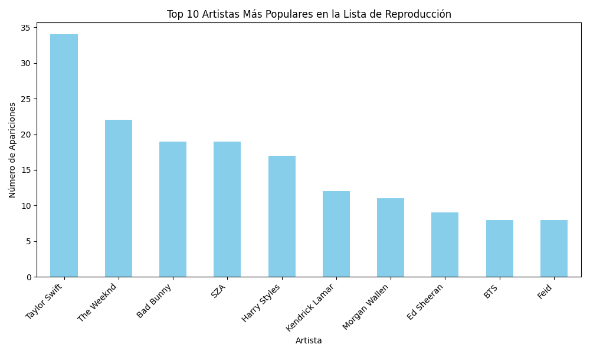

# Análisis de Datos de Spotify

Este proyecto consiste en una serie de scripts en Python para analizar datos de Spotify utilizando el lenguaje de programación Python y las bibliotecas pandas, matplotlib y seaborn.

## Requisitos previos

Antes de ejecutar los scripts, asegúrate de tener instalado Python en tu sistema. También necesitarás instalar las siguientes bibliotecas:

```
pip install pandas matplotlib seaborn
```

## Uso
Clona este repositorio en tu máquina local:

```
git clone https://github.com/tu_usuario/analisisDatos.git
```

Ve al directorio del proyecto:

```
cd analisisDatos
```

Ejecuta cualquiera de los scripts según tu necesidad:

```
python top_artistas.py
python artistas_pocas_reproducciones.py
python colabs.py
python correlacion.py
python palabras_clave.py
python songs_per_playlist.py
python songs_per_year.py
```

## Descripción de los Scripts

`top_artistas.py`: Muestra los 10 artistas más populares en una lista de reproducción de Spotify.

`artistas_pocas_reproducciones.py`: Muestra los 10 artistas menos populares en una lista de reproducción de Spotify.

`colabs.py`: Analiza las colaboraciones entre artistas y muestra los 10 artistas con más colaboraciones.

`correlacion.py`: Calcula y visualiza la matriz de correlación entre las características musicales de las canciones.

`palabras_clave.py`: Analiza la frecuencia de palabras clave en los títulos de las canciones.

`songs_per_playlist.py`: Muestra el número de canciones en las listas de reproducción de Spotify.

`songs_per_year.py`: Muestra el recuento de canciones por año de lanzamiento.


##  Ejemplo 

El archivo `top_artistas.py`: Muestra el top 10 de artistas mas populares en Spotify en 2023.


## Datos

Los datos utilizados en este proyecto se encuentran en el archivo spotify-2023.csv. Este archivo contiene información sobre las canciones, incluyendo el nombre del artista, el nombre de la canción, el año de lanzamiento, etc.

## Contribuciones
Las contribuciones son bienvenidas. Si deseas contribuir a este proyecto, puedes abrir un issue o enviar un pull request.

## Autoría

Estos scripts fueron desarrollados por Fabián Andrés López Ortega.

